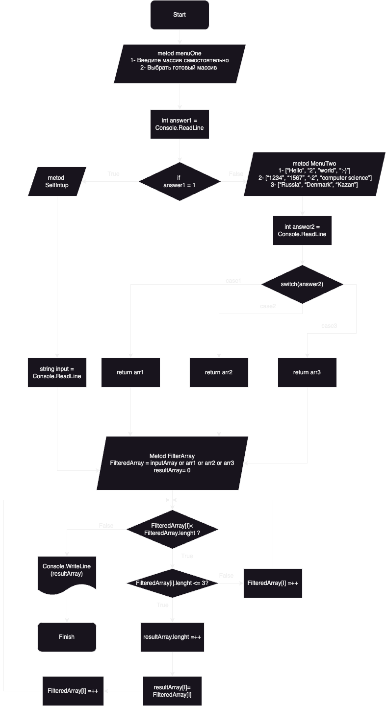
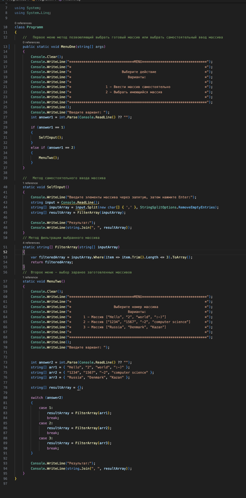
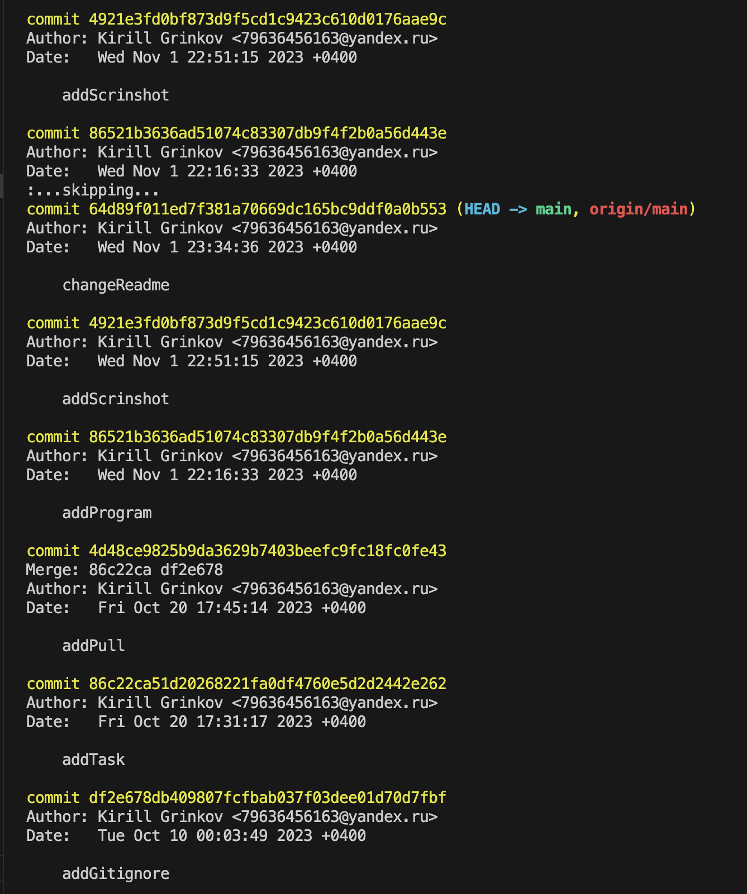

# Задание

Данная работа необходима для проверки ваших знаний и навыков по итогу прохождения первого блока обучения на программе Разработчик. Мы должны убедится, что базовое знакомство с IT прошло успешно.

**Задача алгоритмически не самая сложная, однако для полноценного выполнения проверочной работы необходимо:**

1. Создать репозиторий на GitHub
2. Нарисовать блок-схему алгоритма (можно обойтись блок-схемой основной содержательной части, если вы выделяете её в отдельный метод)
3. Снабдить репозиторий оформленным текстовым описанием решения (файл README.md)
4. Написать программу, решающую поставленную задачу
5. Использовать контроль версий в работе над этим небольшим проектом (не должно быть так, что всё залито одним коммитом, как минимум этапы 2, 3, и 4 должны быть расположены в разных коммитах)

**Задача:** Написать программу, которая из имеющегося массива строк формирует новый массив из строк, длина которых меньше, либо равна 3 символам. Первоначальный массив можно ввести с клавиатуры, либо задать на старте выполнения алгоритма. При решении не рекомендуется пользоваться коллекциями, лучше обойтись исключительно массивами.

**Примеры:**

[“Hello”, “2”, “world”, “:-)”] → [“2”, “:-)”]

[“1234”, “1567”, “-2”, “computer science”] → [“-2”]

[“Russia”, “Denmark”, “Kazan”] → []

# Решение 

1. Создать репозиторий на GitHub

Вы находитесь в репозитории [Test_Block1](https://github.com/KirillGrinkov/Test_Block1/tree/main)

2. Нарисовать блок-схему алгоритма (можно обойтись блок-схемой основной содержательной части, если вы выделяете её в отдельный метод) 

3. Снабдить репозиторий оформленным текстовым описанием решения (файл README.md) 

Файл **README** можно найти по этой [ссылке](https://github.com/KirillGrinkov/Test_Block1/blob/main/README.md)

4. Написать программу, решающую поставленную задачу   

Первое меню,в нем выбираются варианты взаимодействия с программой 

В случае выбора первого варианта, (самостоятельного введения массива) предлагается ввести переменные любово вида через запятую

Если же выбор сделан в пользу второго пункта, пользователю даются на выбор 3 заранее заготовленных массива 

Код программы:

5. Использовать контроль версий в работе над этим небольшим проектом (не должно быть так, что всё залито одним коммитом, как минимум этапы 2, 3, и 4 должны быть расположены в разных коммитах) 

